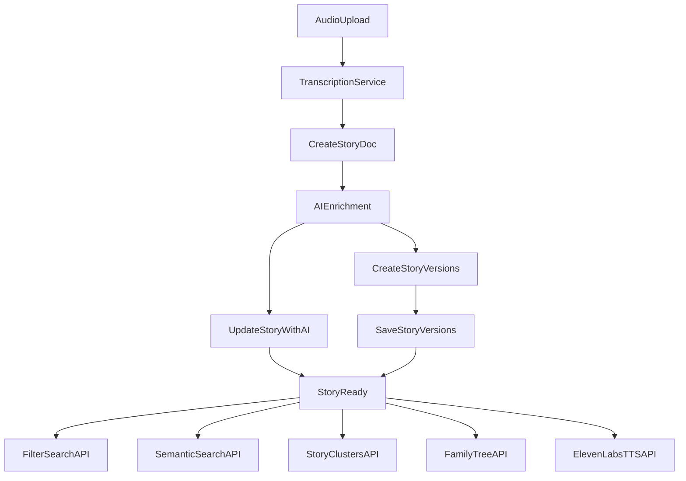

### Goals

- **Enrich stories with structured AI metadata**: mood, referenced dates/period, event types, themes, summaries, and embeddings.
- **Extend MongoDB schema** to support filtering, clustering, multi-version stories, speaker/family associations, and voice search.
- **Design aggregation-based "Story Clusters" and family tree views** using MongoDB pipelines.
- **Support multi-version storytelling and voice-clone playback** via ElevenLabs.

### Assumptions

- **Backend**: Python FastAPI/Starlette-style service (based on `backend/app/db.py`) using MongoDB (likely via Motor/PyMongo).
- **Transcription**: Already available from an external ASR service (e.g., Whisper) and stored per story.
- **Embeddings & LLM**: We can introduce an embedding provider (e.g., OpenAI or similar) orchestrated by the backend, with vectors stored in MongoDB Atlas Vector Search.
- **Mongo**: Hosted on MongoDB Atlas with vector search enabled in at least one collection.
- **Auth & Users**: A `users` collection or equivalent already exists; stories are always associated with a user and optionally with speakers in their family tree.

### High-level Architecture

- **Collections**
  - `**stories`: Core document for each voice memory; stores transcription, metadata, AI annotations, and links to speaker(s), user, and versions.
  - `**speakers`: People/voices involved (user, relatives, historical figures) with associations to users, family tree relations, and ElevenLabs voice IDs.
  - `**story_versions`: Multiple narrative versions for the same underlying story (Original, Children, Cultural, Poetic) with per-version text and TTS metadata.
  - `**story_links` (optional): Explicit edges between stories for graph-like and cluster views when implicit similarity isn’t enough.
- **AI Pipelines** (backend services)
  - **Ingestion pipeline**: After transcription, call an LLM to:
    - Classify **mood** (e.g., joyful, bittersweet, somber).
    - Extract **referenced date/period** (exact date, approximate decade, or life stage).
    - Classify **event type** (marriage, birth, birthday, anniversary, holiday, funeral, migration, etc.).
    - Extract **themes** (family, resilience, migration, love, faith, food, etc.).
    - Generate a **short summary** and possibly a longer abstract.
    - Optionally **chunk** the story into segments and generate embeddings per chunk.
  - **Embedding pipeline**:
    - Use a single embedding model for:
      - Story-level embedding (full transcription or summary).
      - Chunk-level embeddings for long stories.
    - Store embeddings in MongoDB vector fields with the appropriate index definitions.
  - **Version-generation pipeline**:
    - For each story, use prompt templates with an LLM to generate:
      - **Children’s Version**.
      - **Cultural Context Edition** (adds explanatory context for cultural references).
      - **Poetic Adaptation**.
      - Preserve **Original** transcription as-is.
- **Search & Views**
  - **Filtered search**: Fast query path filtering by speaker(s), mood, event type, date range/period, and themes.
  - **Semantic search**: Use query embeddings + MongoDB vector search over summaries/chunks.
  - **Voice search**: Transcribe the search query, embed the text, run vector search, and return ranked stories.
  - **Story Clusters (Obsidian-like)**: Server-side aggregation to group stories into clusters based on:
    - Shared speakers.
    - Overlapping themes.
    - High cosine similarity in embedding space.
  - **Family tree / speaker association view**: Graph-style JSON returned from aggregations over `speakers` and `stories`.

### MongoDB Schema Design

#### `stories` collection

- **Core fields**
  - `_id: ObjectId`
  - `userId: ObjectId` – owner user.
  - `speakerIds: ObjectId[]` – references to `speakers._id` (can include the user themselves).
  - `audioUrl: string` – original audio location.
  - `transcript: string` – full transcription text.
  - `language: string` – ISO code (e.g., `en`, `hi`, `es`).
  - `createdAt: Date`
  - `updatedAt: Date`
- **AI annotations**
  - `mood: string` – normalized set (e.g., `joyful`, `bittersweet`, `nostalgic`, `sad`, `hopeful`).
  - `eventType: string` – controlled vocab: `marriage`, `birthday`, `anniversary`, `birth_of_child`, `migration`, `holiday`, `funeral`, `graduation`, `other`.
  - `themes: string[]` – tags like `family`, `courage`, `immigration`, `tradition`, `food`, `war`, `faith`.
  - `summaryShort: string` – 2–3 sentence summary.
  - `summaryLong: string` – optional longer abstract.
- **Temporal info**
  - `storyDate: Date | null` – precise date if detected.
  - `storyDatePrecision: string` – e.g., `exact`, `year`, `decade`, `approximate_period`.
  - `storyPeriodLabel: string` – e.g., `Childhood`, `Teenage`, `Early Marriage`, `Post-War`, `Pre-Migration`.
- **Embeddings & chunking**
  - `embeddingMain: number[]` – vector for full story or summary (indexed by Mongo vector index).
  - `chunks: [{ index: number, text: string, startTimeSec: number | null, endTimeSec: number | null, embedding: number[] }]` – chunk-level segments and embeddings.
  - `embeddingModel: string` – model name used.
- **Versioning and TTS links**
  - `versionIds: ObjectId[]` – references to `story_versions`.
  - `primaryVersionId: ObjectId | null` – default to show/play.
- **Operational fields**
  - `status: string` – `processing`, `ready`, `error`.
  - `aiProcessingErrors: string[]` – optional logs.

#### `speakers` collection

- **Core fields**
  - `_id: ObjectId`
  - `userId: ObjectId` – owning user/family context.
  - `name: string`
  - `role: string` – `self`, `parent`, `grandparent`, `sibling`, `child`, `relative`, `friend`, etc.
  - `bio: string` – short optional description.
- **Family-tree relations**
  - `relations: [{ type: string, // 'parent', 'child', 'spouse', 'sibling', 'grandparent', etc. targetSpeakerId: ObjectId }]` – allows graph traversal.
- **Voice & TTS integration**
  - `elevenLabsVoiceId: string | null` – voice clone ID for ElevenLabs.
  - `sampleAudioUrls: string[]` – optional training/reference clips.
- **Operational**
  - `createdAt: Date`
  - `updatedAt: Date`

#### `story_versions` collection

- **Core fields**
  - `_id: ObjectId`
  - `storyId: ObjectId` – parent story.
  - `userId: ObjectId`
  - `type: string` – one of `original`, `childrens`, `cultural_context`, `poetic`.
  - `title: string`
  - `text: string`
- **TTS & playback**
  - `defaultSpeakerId: ObjectId | null` – speaker voice to use by default.
  - `audioRenders: [{ speakerId: ObjectId, elevenLabsVoiceId: string, audioUrl: string, createdAt: Date }]` – cached rendered audio versions.
- **Metadata**
  - `language: string`
  - `wordCount: number`
  - `createdAt: Date`
  - `updatedAt: Date`

#### Optional `story_links` collection (for explicit graph edges)

- `_id: ObjectId`
- `userId: ObjectId`
- `fromStoryId: ObjectId`
- `toStoryId: ObjectId`
- `linkType: string` – `similar_theme`, `same_event`, `same_speaker`, `followup_story`, `same_location`.
- `weight: number` – optional similarity score.

### MongoDB Indexing & Vector Setup

- `**stories` collection indexes
  - `{ userId: 1, createdAt: -1 }` – default listing per user.
  - `{ userId: 1, mood: 1, createdAt: -1 }` – mood filters.
  - `{ userId: 1, eventType: 1, createdAt: -1 }` – event-type filters.
  - `{ userId: 1, speakerIds: 1, createdAt: -1 }` – filter by speaker.
  - `{ userId: 1, storyDate: 1 }` – date/period filters.
  - `{ userId: 1, themes: 1 }` – theme filters.
  - **Vector index** on `embeddingMain` (and optionally `chunks.embedding`) using MongoDB Atlas Vector Search configuration.
- `**speakers` collection indexes
  - `{ userId: 1, name: 1 }`
  - `{ userId: 1, role: 1 }`
- `**story_versions` collection indexes
  - `{ storyId: 1, type: 1 }`
  - `{ userId: 1, type: 1 }`

### Backend Service Design

#### 1) Story ingestion + AI enrichment

- **Endpoint**: `POST /stories` (or `POST /stories/{id}/transcription-complete` if ASR is external).
- **Flow**:
  1. Save primary `stories` document with user, raw transcript, audio URL, status=`processing`.
  2. Place a message onto a background queue (e.g., Celery/RQ/worker) or use async task:
  - Call LLM for mood, eventType, referenced dates/period, themes, and summaries (using a prompt template).
  - Chunk the transcript (e.g., by time segment or paragraph) and compute embeddings for main story + each chunk.
  - Update the `stories` doc with all AI fields and embeddings.
  - Generate the three alternative versions (children’s, cultural context, poetic) and store them in `story_versions`.
  - Update `versionIds` and `primaryVersionId` in `stories`.
  - Log any AI errors; set `status` to `ready` when done.
- **Prompt structure for classification & extraction**: Single well-structured system prompt that instructs the model to return JSON fields for:
  - `mood`, `eventType`, `themes`, `storyDate`, `storyDatePrecision`, `storyPeriodLabel`, `summaryShort`, `summaryLong`.

#### 2) Filtering & search APIs

- **Endpoint**: `GET /stories`
  - Query params: `speakerId`, `mood`, `eventType`, `theme`, `dateFrom`, `dateTo`, `period`, `limit`, `offset`.
  - Implementation: Build a Mongo query with the above filters and sort by `createdAt` or `storyDate`.
- **Endpoint**: `POST /stories/search` (semantic text search)
  - Body: `{ queryText: string, speakerId?: string, mood?: string, eventType?: string, topK?: number }`.
  - Flow:
    1. Embed the `queryText`.
    2. Use MongoDB vector search on `embeddingMain` (and/or `chunks.embedding`) filtered by `userId` and any extra filters.
    3. Return top `K` stories with similarity scores.
- **Endpoint**: `POST /stories/search/voice`
  - Body: audio blob or URL.
  - Flow:
    1. Transcribe query audio.
    2. Reuse same semantic text search pipeline.

#### 3) Story clusters (Obsidian-like view)

- **Endpoint**: `GET /stories/clusters`
  - Query params: `basis` (`speaker`, `theme`, `similarity`), `minSize`, `limit`.
- **Cluster-by-speaker aggregation** (conceptual pipeline):
  - `$match`: by `userId`.
  - `$unwind`: `$speakerIds`.
  - `$group`: `_id: '$speakerIds'`, `stories: { $push: { _id, title: '$summaryShort', mood, eventType, themes }}`.
  - Optional: `$lookup` into `speakers` to get node labels.
  - Return nodes (`speaker`, `story`) and edges (`speaker`–`story`).
- **Cluster-by-theme aggregation**:
  - `$unwind`: `$themes`.
  - `$group`: `_id: '$themes'`, `stories: [ ... ]`.
- **Cluster-by-similarity**:
  - Either:
    - Use offline job to build `story_links` edges based on similarity thresholds and store them.
    - Or call vector search per story periodically and persist highest-similarity neighbors in `story_links`.
  - Aggregation returns **clusters** by walking similarity edges (e.g., union-find or BFS in application layer).
- **Graph-like response shape**:
  - `nodes: [{ id, type: 'story' | 'speaker' | 'theme', label, data: {...} }]`
  - `edges: [{ from, to, type }]`
  - Frontend can render this similar to Obsidian’s graph view.

#### 4) Family tree / speaker association view

- **Endpoint**: `GET /speakers/tree`
  - Query params: `rootSpeakerId?` (default user’s `self` node).
  - Aggregation pipeline concept:
    - `$match`: `userId`.
    - Return all speakers and their `relations` array.
  - Application builds a tree/graph in memory:
    - Nodes: speakers.
    - Edges: typed relations (`parent`, `child`, `spouse`, etc.).
  - Include aggregate stats per speaker (number of stories, moods) via `$lookup` into `stories` and `$group`.

#### 5) Multi-version stories APIs

- **Endpoint**: `GET /stories/{storyId}/versions`
  - Returns all `story_versions` with basic metadata.
- **Endpoint**: `GET /stories/{storyId}/versions/{type}`
  - Returns specific version (e.g., `childrens`, `cultural_context`, `poetic`, `original`).
- **Endpoint**: `POST /stories/{storyId}/versions/regenerate`
  - Body: `{ types: string[] }` – regenerate specified versions via LLM and overwrite/update `story_versions`.

#### 6) ElevenLabs voice-clone playback

- **Endpoint**: `POST /stories/{storyId}/versions/{versionId}/tts`
  - Body: `{ targetSpeakerId: string }`.
  - Flow:
    1. Fetch `story_versions` doc (and validate `userId`).
    2. Look up `speakers[targetSpeakerId].elevenLabsVoiceId`.
    3. If not present, return error prompting user to set up voice clone.
    4. Call ElevenLabs TTS API with chosen voice ID and `version.text`.
    5. Store returned audio (e.g., in S3/GCS) and persist an entry in `audioRenders` for caching.
    6. Return URL for playback.
- **Endpoint**: `GET /stories/{storyId}/versions/{versionId}/tts`
  - Fetch or trigger generation for a default speaker (if configured).

### Story Lifecycle Diagram (Mermaid)

### Implementation Tasks (Todos)

- **schema-update**: Update or define the `stories`, `speakers`, and `story_versions` models in the backend (e.g., Pydantic/FastAPI models and Mongo access layer) to match the fields above.
- **ai-pipeline**: Implement the post-transcription AI enrichment pipeline (mood/event/themes/date/summaries + embeddings + chunking) using an LLM + embedding model, and wire it into the story creation flow.
- **vector-indexing**: Configure MongoDB Atlas vector indexes on `stories.embeddingMain` (and optionally `stories.chunks.embedding`) and expose an embedding helper in the backend.
- **search-apis**: Implement REST endpoints for filtered search, semantic text search, and voice search using transcription + embeddings.
- **clusters-apis**: Implement aggregation pipelines and endpoints for speaker-based clusters, theme-based clusters, and similarity-based clusters with graph-style responses.
- **family-tree-apis**: Implement speaker CRUD, relations, and a `GET /speakers/tree` endpoint that returns a navigable family graph with per-speaker story counts.
- **versions-apis**: Implement LLM-based generation and CRUD for story versions, plus endpoints to list, fetch, and regenerate versions.
- **tts-integration**: Integrate ElevenLabs TTS for rendering story versions into alternate speakers’ voices, with caching of rendered audio URLs and simple error handling.
